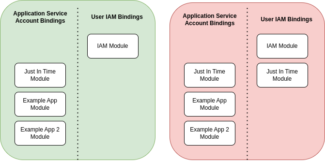

### How does a user use jit-access?
- Access the web applications front page. 
- Enters the project id where they want the escalated role.
- Selects which role they need from the available list.
- Chooses how long they would like the requested access.
- inputs reason or ticket id.
- Magic! 


### How do I configure what jit roles I assign a user?
Because I chose to exclude User role assignment in this [module](faq.md#why-didnt-you-include-the-ability-to-configure-the-users-from-this-module). In order to make jit-access work from this module you will need to configure the access your users have.  
You can either do this manually explained [here](https://cloud.google.com/iam/docs/managing-conditional-role-bindings)
Or if you use terraform to manage your User Iam you can add a condition block to these. e.g.
```terraform

resource "google_project_iam_member" "default" {

  role    = "role/container.admin"
  member  = "user@company.com"
  project = var.project
  condition {
    title      = "Eligible for JIT access"
    expression = "has({}.jitAccessConstraint)"
  }
}
```


### Why can't I delete the IAP brand?

The Identity Aware Proxy brand is a part of the Oauth consent screen configuration and does not support [DELETE](https://cloud.google.com/iap/docs/reference/rest/v1/projects.brands)

> **WARNING:**
> If you run `terragrunt destroy` it will remove the reference in state without deleting the actual resource. 
> You will be unable to redeploy using this into the same project.

https://registry.terraform.io/providers/hashicorp/google/latest/docs/resources/iap_brand
https://cloud.google.com/config-connector/docs/reference/resource-docs/iap/iapbrand?_ga=2.66726062.-1065645020.1689868828
https://developers.google.com/workspace/guides/configure-oauth-consent


### Why didn't you include the ability to configure the users from this module? 

Many organisations will have IAM configured for Users in a single place. Providing the option to include
some here would encourage some configuration to move to this module.<br> 
Making it less intuitive and needlessly more complicated. Especially as the Roles in jit will be Break Glass and likely far more permissive.<br>
Keeping these tucked away is not cool! <br>




If you are looking for a module that can help implement User Role bindings try <br>
https://registry.terraform.io/modules/terraform-google-modules/iam/google/latest/submodules/projects_iam


### Why didn't you include Multi Party Approval?
multi party approval is a feature of jit-access that allows you to permit a role but require someone who has that role assigned
to approve the request before it is assigned. <br>
I didn't include this configuration for a couple of reasons.
1. I wasn't able to completely test the feature out without paying for workspace licences.
2. From my experience emails are not a natural way request approvals and will often be overlooked
3. The list of peers who have the authority to approve requests only include those who have the `"has({}.multiPartyApprovalConstraint)"` condition.
    I feel like the purpose of this kind of request would work more effectively if you allowed conditionless users to also approve request.
4. As of writing this there is a PR in review to implement slack, which i will try to incorporate as soon as it becomes available. 
    * GoogleCloudPlatform/jit-access#60


### Why cant I use a private registry thats not Google Cloud?

Cloud run only supports Google Cloud private registries and a few public registries directly.
https://cloud.google.com/run/docs/deploying#other-registries
It is possible to use Google Cloud to temporarily store these to load into Cloud Run. This isnt supported by this module... yet?